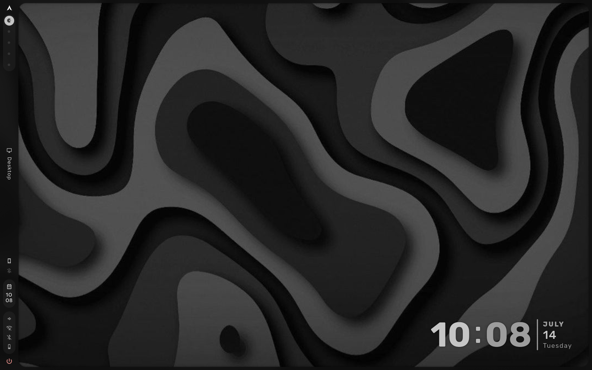

# hyprdots-0 

A stunning lenovo ideapad slim 3 configuration. I love this setup.
This is my configuration for the caelestia shell, and uses latest bleeding, unstable caelestia version. 
Installation is as follows.

```bash
yay -S caelestia-cli-git
caelestia install --enable-components=zen,zed,uwsm
yay -S caelestia-cli-git caelestia-shell-git 
```

- Install Hyprland.
- Install Caelestia.
- Edit shell.json.
- Remove bloatware.
- Edit ~/.config/hypr.
- Add functionalities. 
- Save the dots.

## Gallery


